# BazarGo — Системный Архитектурный Blueprint

> **Статус:** Документ проектирования. Режим — только чтение и анализ. Никакие изменения кода, миграции или данные не изменялись.
> **Дата:** 2026-09-30
> **Версия кода:** текущее состояние main-ветки локального репозитория

---

## Содержание

1. [Краткое описание продукта и текущего состояния](#1-краткое-описание-продукта)
2. [Карта функциональности](#2-карта-функциональности)
3. [Текущая архитектура (AS-IS)](#3-текущая-архитектура-as-is)
4. [Целевая архитектура (TO-BE)](#4-целевая-архитектура-to-be)
5. [Фактическая ER-диаграмма](#5-фактическая-er-диаграмма)
6. [Целевая ER-диаграмма](#6-целевая-er-диаграмма)
7. [Сравнение моделей данных](#7-сравнение-моделей-данных)
8. [Схема административной панели](#8-схема-административной-панели)
9. [Матрица ролей и разрешений](#9-матрица-ролей-и-разрешений)
10. [Диаграммы ключевых бизнес-процессов](#10-диаграммы-ключевых-бизнес-процессов)
11. [Схема событий и уведомлений](#11-схема-событий-и-уведомлений)
12. [Комплексный реестр проблем](#12-комплексный-реестр-проблем)
13. [Анализ безопасности](#13-анализ-безопасности)
14. [Анализ производительности](#14-анализ-производительности)
15. [Стратегия тестирования](#15-стратегия-тестирования)
16. [Масштабный план разработки](#16-масштабный-план-разработки)
17. [Реестр архитектурных решений для согласования](#17-реестр-архитектурных-решений)
18. [Открытые вопросы](#18-открытые-вопросы)

---

## 1. Краткое описание продукта

**BazarGo** — это полноценный маркетплейс для рынка Кыргызстана. Платформа соединяет покупателей и продавцов, поддерживает физических лиц и магазины, реализует полный торговый цикл: от публикации объявления до завершения заказа.

### Технологический стек (подтверждено)

| Слой | Технология |
|------|-----------|
| Frontend | Next.js 16.3.5 (App Router), React 19, TypeScript |
| Styling | Tailwind CSS, shadcn/ui |
| i18n | next-intl (ru + ky) |
| BaaS | Supabase (PostgreSQL, Auth, Storage, Realtime) |
| ORM | Supabase JS Client (typed queries) |
| Валидация | Zod |
| Auth | Supabase Auth (email/OTP, phone — в коде есть `phone-auth-form.tsx`) |
| Storage | Supabase Storage (бакеты: `product-images`, `store-images`) |
| Cron | Vercel Cron → `/api/cron/expire-orders` → RPC `expire_pending_orders` |
| Тесты | Playwright (E2E, 4 теста) |
| Поиск | pg_trgm, RPC `search_catalog_listings`, синонимы |

### Текущее состояние (общая оценка)

| Подсистема | Состояние |
|-----------|---------|
| Аутентификация | ✅ Работает (email OTP, создание профиля через trigger) |
| Объявления (создание/редактирование) | ✅ Работает с загрузкой изображений |
| Каталог с фильтрами и пагинацией | ✅ Работает |
| Поиск (pg_trgm + синонимы) | ✅ Работает |
| Корзина | ✅ Работает |
| Оформление заказа (атомарное RPC) | ✅ Работает, возвращает ID заказов |
| Заказы (управление статусами) | ✅ Работает через state-machine RPC |
| Чаты | ✅ Работает (realtime + rate limit) |
| Уведомления | ✅ Работает (триггеры + realtime) |
| Запросы покупателей | ✅ Работает |
| Предложения продавцов | ✅ Работает |
| Магазины | ✅ Работает (создание, slug, follow) |
| Избранное | ✅ Работает |
| Жалобы | ✅ Работает (UI + RPC) |
| Блокировки пользователей | ✅ Работает (peer + admin) |
| B2B (заявки поставщиков) | ✅ Работает (не изменять) |
| Административная панель | ⚠️ Частично (dashboard, users, listings, reports; недостаточно страниц) |
| Удаление аккаунта | ✅ Работает (state-machine + fencing token) |
| Экспирация заказов | ✅ Работает (Vercel Cron + RPC) |
| Локализация (ru/ky) | ✅ Завершена в предыдущих этапах |

---

## 2. Карта функциональности

### 2.1 Auth & Identity

| Маршрут/Компонент | Таблицы | Статус |
|---|---|---|
| `/[locale]/(auth)/login/page.tsx` | `auth.users`, `profiles` | ✅ Реализовано |
| `phone-auth-form.tsx` | `auth.users` | ⚠️ Присутствует, не тестировался |
| `auth/callback/route.ts` | `auth.users` | ✅ Реализовано |
| Trigger `on_auth_user_created` | `profiles` | ✅ Реализовано |

**Отсутствует:** восстановление пароля через email (magic link есть в Supabase, но UI нет), управление сессиями, OAuth (Google/Apple).

### 2.2 Профили и настройки

| Маршрут/Компонент | Таблицы | Статус |
|---|---|---|
| `/profile/page.tsx` | `profiles` | ✅ Реализовано |
| `/settings/page.tsx`, `settings-form.tsx` | `profiles` | ✅ Реализовано |
| `/settings/account/page.tsx` | `profiles`, `account_deletion_requests` | ✅ Реализовано |
| `account-deletion-form.tsx` | `account_deletion_requests` | ✅ Реализовано |
| `actions/settings.ts` | `profiles` | ✅ Реализовано |

**Отсутствует:** загрузка аватара через UI (поле `avatar_url` в profiles есть), подтверждение email/phone.

### 2.3 Роли и права

- **Реализовано:** `USER_ROLE ENUM: USER, ADMIN, SUPER_ADMIN, MODERATOR, SUPPORT` — в БД.
- **Реализовано:** `src/lib/rbac.ts` — матрица прав, `hasPermission()`.
- **Реализовано:** `verifyAdminAccess()` в `features/admin/actions.ts` — двойная проверка на сервере.
- **Триггер:** `prevent_privilege_escalation` — предотвращает самоповышение роли.
- **Отсутствует:** UI смены роли для SUPER_ADMIN (только через DB).

### 2.4 Категории

| Компонент | Таблица | Статус |
|---|---|---|
| `features/catalog/components/category-picker.tsx` | `categories` | ✅ Реализовано |
| `features/sell/components/steps/product-details.tsx` | `categories` | ✅ Реализовано |

Таблица `categories` поддерживает иерархию (поле `parent_id`). Сидирование базовых категорий в миграции. Каталог корректно строит breadcrumbs по `parent_id`.

**Отсутствует:** UI управления категориями в админке.

### 2.5 Объявления

| Маршрут/Компонент | Таблицы | Статус |
|---|---|---|
| `/sell/page.tsx`, `sell-flow.tsx` | `listings`, `listing_images` | ✅ Реализовано |
| `/my-listings/page.tsx`, `my-listings-client.tsx` | `listings` | ✅ Реализовано |
| `/product/[id]/page.tsx` | `listings`, `listing_images`, `profiles` | ✅ Реализовано |
| `app/actions/sell.ts` (publishListing) | `listings`, `listing_images`, storage | ✅ Реализовано |

**Реализовано:** создание, редактирование с заменой изображений, удаление старых файлов из Storage при редактировании, rate limit 10 объявлений/час.
**Отсутствует:** полноценное редактирование без переоткрытия формы (edit page отдельной нет, логика внутри sell-flow по `id`).

**Статусы объявления (подтверждено в миграциях):**
`ACTIVE`, `DEACTIVATED`, `SOLD`, `OUT_OF_STOCK`, `ARCHIVED`, `BLOCKED`, `PENDING` (если нужна модерация).

### 2.6 Фотографии и Storage

- Бакеты: `product-images`, `store-images`.
- Политики: публичный SELECT, аутентифицированный INSERT только в папку `userId/...`, DELETE только владельцем.
- Валидация: `src/lib/image-validation.ts` проверяет формат и размер.
- **Реализовано:** загрузка, замена при редактировании, очистка старых файлов из Storage.
- **Не реализовано:** ресайз/оптимизация на стороне сервера (загружаются полноразмерные файлы), CDN-трансформации.

### 2.7 Каталог, поиск и фильтры

| Компонент | Статус |
|---|---|
| `/catalog/page.tsx` с `CatalogList` | ✅ Пагинация (20/стр, max 50 стр) |
| `catalog-filters-widget.tsx` | ✅ Фильтры по региону, городу, цене, состоянию, категории |
| `catalog-sort.tsx` | ✅ Сортировка (новые, цена asc/desc) |
| `catalog-load-more.tsx` | ✅ Подгрузка страниц |
| RPC `search_catalog_listings` | ✅ pg_trgm + синонимы |
| Таблица `search_synonyms` | ✅ Защищена RLS (только SELECT публично) |

### 2.8 Избранное

| Компонент | Таблица | Статус |
|---|---|---|
| `shared/favorite-button.tsx` | `favorites` | ✅ Реализовано |
| `/favorites/page.tsx` | `favorites`, `listings` | ✅ Реализовано |
| `app/actions/favorites.ts` | `favorites` | ✅ Реализовано |

### 2.9 Корзина и оформление заказа

| Компонент/RPC | Статус |
|---|---|
| `/cart/page.tsx`, `cart-view.tsx` | ✅ Реализовано |
| `app/actions/cart.ts` (addToCart, updateQuantity, removeFromCart) | ✅ Реализовано |
| `checkoutCart()` → RPC `create_orders_from_cart()` | ✅ Реализовано, возвращает `UUID[]` |
| Конкурентная блокировка строк в RPC (`FOR UPDATE`) | ✅ Реализовано |
| Проверка резервирования через PENDING+CONFIRMED заказы | ✅ Реализовано |
| Экспирация PENDING заказов (Vercel Cron, 15 мин) | ✅ Реализовано |

### 2.10 Заказы

| Маршрут/RPC | Статус |
|---|---|
| `/orders/page.tsx` (покупатель) | ✅ Реализовано |
| `/orders/[id]/page.tsx` | ✅ Реализовано |
| `/seller/orders/page.tsx` | ✅ Реализовано |
| `/seller/orders/[id]/page.tsx` | ✅ Реализовано |
| RPC `confirm_order`, `reject_order`, `cancel_order` | ✅ Реализовано (state machine) |
| RPC `complete_order` (инвентарь + статус атомарно) | ✅ Реализовано |
| Trigger `protect_order_integrity` | ✅ Реализовано |

**Статусы заказа:** `PENDING → CONFIRMED → COMPLETED` / `PENDING → REJECTED` / `PENDING,CONFIRMED → CANCELLED` / `PENDING → EXPIRED`.

**Отсутствует:** возвраты, споры (диспуты) как формальный процесс; `payment_status` и `delivery_type` — поля упоминаются в старом RPC (stage9_1), но в текущей версии RPC используется `create_orders_from_cart`, не включающий эти поля.

> **⚠️ Подтверждённый дефект:** Старый RPC в `stage9_1_hardening.sql` пишет `INSERT INTO orders (buyer_id, seller_id, status, total_amount)` без `payment_status`/`delivery_type`. Они могут существовать как поля в БД (добавлены в `p1_checkout_return.sql`) и NOT NULL без дефолта — это вызовет ошибку при checkout. Требует проверки.

### 2.11 Магазины

| Маршрут/Компонент | Статус |
|---|---|
| `/stores/page.tsx` | ✅ Реализовано |
| `/stores/create/page.tsx`, `store-form.tsx` | ✅ Реализовано |
| `/my-store/page.tsx`, `/my-store/edit/page.tsx` | ✅ Реализовано |
| `/store/[slug]/page.tsx` | ✅ Реализовано |
| `features/stores/components/follow-button.tsx` | ✅ Реализовано |
| RPC `get_store_active_listings_counts` | ✅ Реализовано |
| Ограничение 1 магазин на пользователя | ✅ Реализовано (`20260921180000_stores_unique_owner.sql`) |

### 2.12 Чаты и сообщения

| Компонент/RPC | Статус |
|---|---|
| `/messages/page.tsx` (список чатов) | ✅ Реализовано |
| `/messages/[id]/page.tsx` (чат) | ✅ Реализовано |
| `features/chat/components/chat-room.tsx` | ✅ Реализовано |
| RPC `get_chats_with_unread(limit, offset)` | ✅ Реализовано с пагинацией |
| RPC `send_message_transaction` (rate limit 60/5мин) | ✅ Реализовано |
| Realtime subscription на `messages` | ✅ Реализовано |
| Блокировка чатов при взаимном блоке | ✅ RLS policy |

**Отсутствует:** вложения/файлы в чатах, unread badge на иконке сообщений в хедере (только в NotificationsDropdown).

### 2.13 Уведомления

**Реализованные триггеры:**
- `trigger_notify_new_message` — при новом сообщении
- `trigger_notify_new_offer` — при предложении на запрос
- `trigger_notify_new_order` — при создании заказа (продавцу)
- `trigger_notify_order_status_change` — при смене статуса заказа
- `trigger_notify_request_status_change` — при истечении запроса

**Клиент:** `notifications-dropdown.tsx` — realtime subscription + RPC `get_unread_notifications_count`.

**⚠️ Дефект:** Уведомление CANCELLED отправляется `seller_id` при отмене, но не ясно кем отменён заказ (триггер не знает инициатора). При отмене продавцом покупатель не уведомляется.

**Дефект:** Нотификационные сообщения в триггерах захардкожены на русском (`'Новое сообщение от ' || v_sender_name`). При смене языка пользователя уведомления придут на русском.

### 2.14 Запросы и предложения

| Маршрут/Компонент | Статус |
|---|---|
| `/requests/page.tsx` | ✅ Реализовано |
| `/requests/create/page.tsx`, `request-form.tsx` | ✅ Реализовано |
| `/requests/[id]/page.tsx` | ✅ Реализовано |
| `/my-requests/page.tsx`, `my-requests-client.tsx` | ✅ Реализовано |
| `features/requests/components/offer-form.tsx` | ✅ Реализовано |
| `app/actions/requests.ts` | ✅ Реализовано |

**Статусы запроса:** `ACTIVE`, `EXPIRED`, `CLOSED` (via `request_status` enum).

### 2.15 B2B

| Маршрут/Компонент | Статус |
|---|---|
| `/b2b/page.tsx` | ✅ Реализовано |
| `/b2b/become-supplier/page.tsx` | ✅ Реализовано |
| `/b2b/my-applications/page.tsx` | ✅ Реализовано |
| `supplier-application-form.tsx` | ✅ Реализовано |
| Таблица `b2b_applications` | ✅ Реализовано |
| Admin: `/admin/requests/page.tsx` | ✅ Реализовано (просмотр B2B заявок) |

### 2.16 Жалобы и модерация

| Компонент/RPC | Статус |
|---|---|
| `features/reports/components/report-modal.tsx` | ✅ Реализовано |
| `features/reports/actions.ts` | ✅ Реализовано |
| `features/admin/components/report-actions.tsx` | ✅ Реализовано |
| RPC `admin_resolve_report` | ✅ Реализовано |
| `admin/reports/page.tsx` | ✅ Реализовано |

### 2.17 Административная панель

| Маршрут | Содержимое | Статус |
|---|---|---|
| `/admin/page.tsx` | Dashboard: 5 счётчиков (users, listings, reports, stores, orders) | ✅ Базово реализовано |
| `/admin/users/page.tsx` | Список + поиск + ban/unban actions | ✅ Реализовано |
| `/admin/listings/page.tsx` | Список + moderate actions | ✅ Реализовано |
| `/admin/reports/page.tsx` | Список + resolve actions | ✅ Реализовано |
| `/admin/stores/page.tsx` | Список магазинов | ✅ Реализовано |
| `/admin/orders/page.tsx` | Список заказов | ✅ Реализовано |
| `/admin/audit-logs/page.tsx` | Просмотр журнала | ✅ Реализовано |
| `/admin/requests/page.tsx` | B2B заявки | ✅ Реализовано |
| `/admin/account-deletions/page.tsx` | Запросы на удаление | ✅ Реализовано |

**Отсутствует:** страница детали пользователя `/admin/users/[id]`, управление категориями, управление синонимами поиска (таблица есть, UI нет), назначение модераторов через UI.

### 2.18 Публичные страницы

`/about`, `/help`, `/contacts`, `/legal`, `/privacy`, `/terms`, `/safety` — статические страницы с контентом. Реализованы.

### 2.19 Тесты

| Файл | Покрытие |
|---|---|
| `tests/e2e/i18n.spec.ts` | Переключение языка, URL, html lang |
| `tests/e2e/auth.spec.ts` | Страница логина, email валидация |
| `tests/e2e/catalog.spec.ts` | Загрузка каталога, поиск |
| `tests/e2e/cart.spec.ts` | Редирект неавторизованного пользователя |

**Критически отсутствует:** unit-тесты бизнес-логики, тесты RLS, тесты RPC, E2E полного пути покупки, E2E для продавца.

---

## 3. Текущая архитектура (AS-IS)

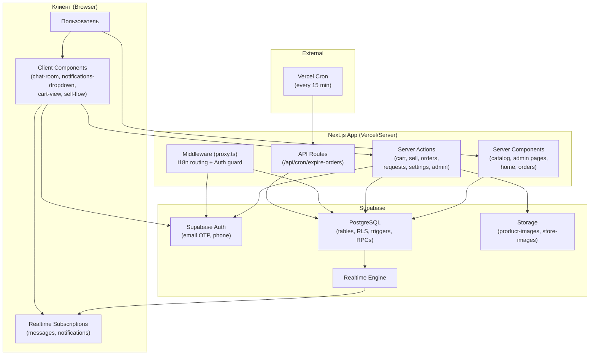

### Текущее разделение Server/Client компонентов

| Компонент | Тип | Причина |
|---|---|---|
| `/catalog/page.tsx` (CatalogList) | Server | SSR с данными из БД |
| `catalog-filters-widget.tsx` | Client | Управление URL params |
| `notifications-dropdown.tsx` | Client | Realtime subscription |
| `chat-room.tsx` | Client | Realtime subscription |
| `cart-view.tsx` | Client | Интерактивные действия |
| `sell-flow.tsx` | Client | Многошаговая форма |
| Admin pages | Server | SSR с adminClient |

---

## 4. Целевая архитектура (TO-BE)

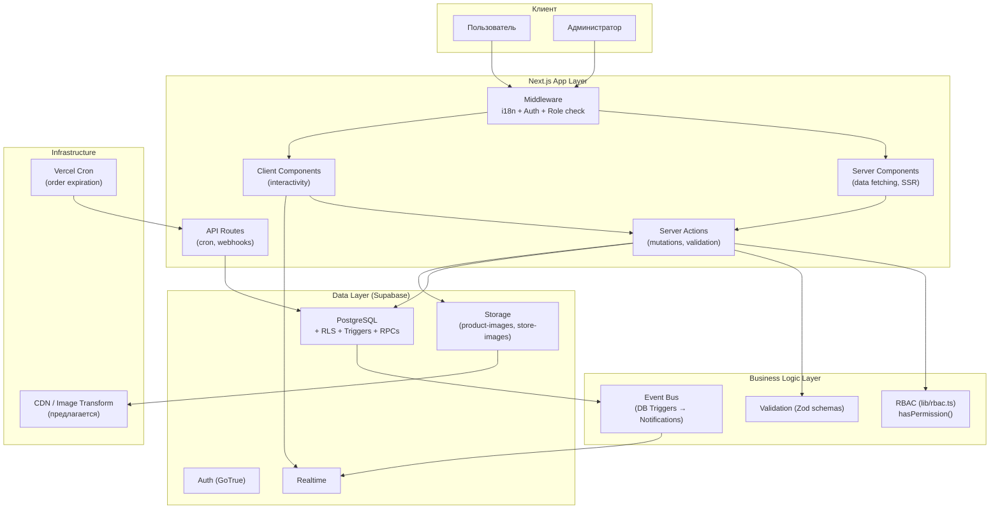

### Предлагаемые изменения архитектуры

1. **Image CDN трансформации** — использовать Supabase Storage Transform API или `next/image` с remote patterns для ресайза при отдаче (не при загрузке). Не требует изменения схемы.

2. **Server-to-Server уведомления о ролях** — сейчас нет уведомления при смене роли. Добавить триггер `notify_role_change`.

3. **Observability** — нет централизованного логирования ошибок (Sentry или аналог). Добавить в SA и API.

---

## 5. Фактическая ER-диаграмма

> Диаграмма построена на основе ВСЕХ миграций. Состояние: актуальное.

```mermaid
erDiagram
    auth_users {
        uuid id PK
        text email
        text phone
    }

    profiles {
        uuid id PK "FK -> auth.users"
        varchar phone
        varchar full_name
        text avatar_url
        varchar city
        enum role "USER|ADMIN|SUPER_ADMIN|MODERATOR|SUPPORT"
        boolean is_verified
        boolean is_banned
        text ban_reason
        timestamptz banned_at
        timestamptz created_at
        timestamptz updated_at
    }

    categories {
        uuid id PK
        varchar name
        varchar slug UK
        uuid parent_id FK "self-ref"
        varchar icon_name
        timestamptz created_at
    }

    products {
        uuid id PK
        varchar brand
        varchar model
        uuid category_id FK
        timestamptz created_at
    }

    stores {
        uuid id PK
        uuid owner_id FK "-> profiles"
        varchar name
        text description
        text logo_url
        uuid category_id FK
        varchar city
        varchar slug UK
        varchar phone
        varchar email
        enum status "PENDING|APPROVED|BLOCKED"
        boolean is_verified
        timestamptz created_at
        timestamptz updated_at
    }

    listings {
        uuid id PK
        uuid seller_id FK "-> profiles"
        uuid store_id FK "-> stores"
        uuid product_id FK "-> products"
        uuid category_id FK "-> categories"
        varchar title
        text description
        numeric price
        enum condition "NEW|USED|REFURBISHED"
        integer quantity
        enum status "ACTIVE|DEACTIVATED|SOLD|OUT_OF_STOCK|ARCHIVED|BLOCKED"
        enum listing_type "SIMPLE|SINGLE|INVENTORY"
        varchar city
        varchar region
        jsonb delivery_methods
        boolean show_phone
        timestamptz created_at
        timestamptz updated_at
    }

    listing_images {
        uuid id PK
        uuid listing_id FK "-> listings"
        text url
        integer order_index
        timestamptz created_at
    }

    favorites {
        uuid user_id FK "-> profiles"
        uuid listing_id FK "-> listings"
        timestamptz created_at
    }

    follows {
        uuid follower_id FK "-> profiles"
        uuid followed_profile_id FK "-> profiles (nullable)"
        uuid followed_store_id FK "-> stores (nullable)"
        timestamptz created_at
    }

    chats {
        uuid id PK
        uuid listing_id FK "-> listings (nullable)"
        uuid buyer_id FK "-> profiles"
        uuid seller_id FK "-> profiles"
        timestamptz created_at
        timestamptz updated_at
    }

    messages {
        uuid id PK
        uuid chat_id FK "-> chats"
        uuid sender_id FK "-> profiles"
        text content
        boolean is_read
        timestamptz created_at
    }

    orders {
        uuid id PK
        uuid buyer_id FK "-> profiles"
        uuid seller_id FK "-> profiles"
        uuid store_id FK "-> stores (nullable)"
        enum status "PENDING|CONFIRMED|COMPLETED|REJECTED|CANCELLED|EXPIRED"
        numeric total_amount
        timestamptz expires_at
        timestamptz confirmed_at
        timestamptz completed_at
        timestamptz cancelled_at
        timestamptz created_at
        timestamptz updated_at
    }

    order_items {
        uuid id PK
        uuid order_id FK "-> orders"
        uuid listing_id FK "-> listings (nullable)"
        integer quantity
        numeric unit_price
        varchar title_snapshot
        text image_url_snapshot
        timestamptz created_at
    }

    cart_items {
        uuid id PK
        uuid user_id FK "-> profiles"
        uuid listing_id FK "-> listings"
        integer quantity
        timestamptz created_at
    }

    requests {
        uuid id PK
        uuid user_id FK "-> profiles"
        varchar title
        uuid category_id FK "-> categories"
        numeric max_price
        enum condition
        text description
        varchar city
        varchar region
        enum status "ACTIVE|EXPIRED|CLOSED"
        timestamptz expires_at
        timestamptz created_at
        timestamptz updated_at
    }

    request_offers {
        uuid id PK
        uuid request_id FK "-> requests"
        uuid seller_id FK "-> profiles"
        uuid listing_id FK "-> listings (nullable)"
        text message
        timestamptz created_at
    }

    notifications {
        uuid id PK
        uuid user_id FK "-> profiles"
        varchar type
        text message
        text link
        boolean is_read
        timestamptz created_at
    }

    reports {
        uuid id PK
        uuid reporter_id FK "-> auth.users"
        uuid target_id
        enum target_type "LISTING|USER|MESSAGE|STORE"
        varchar reason
        text description
        enum status "OPEN|IN_REVIEW|RESOLVED|REJECTED"
        uuid moderator_id FK "-> auth.users (nullable)"
        text resolution_notes
        timestamptz created_at
        timestamptz resolved_at
    }

    user_blocks {
        uuid id PK
        uuid blocker_id FK "-> auth.users"
        uuid blocked_id FK "-> auth.users"
        text reason
        timestamptz created_at
    }

    audit_logs {
        uuid id PK
        uuid actor_id FK "-> auth.users (nullable)"
        varchar action
        uuid target_id
        varchar target_type
        text reason
        jsonb metadata
        timestamptz created_at
    }

    rate_limits {
        uuid id PK
        inet ip_address
        uuid user_id FK "-> auth.users (nullable)"
        varchar action_type
        timestamptz created_at
    }

    search_synonyms {
        uuid id PK
        varchar keyword UK
        text[] synonyms
    }

    b2b_applications {
        uuid id PK
        uuid user_id FK "-> profiles"
        text company_name
        text contact_name
        text phone
        text city
        text categories
        text description
        enum status "PENDING|APPROVED|REJECTED"
        timestamptz created_at
        timestamptz updated_at
    }

    account_deletion_requests {
        uuid id PK
        uuid user_id FK "-> profiles"
        timestamptz created_at
    }

    auth_users ||--|| profiles : "1:1 trigger"
    profiles ||--o{ listings : "seller"
    profiles ||--o{ stores : "owner"
    profiles ||--o{ favorites : "user"
    profiles ||--o{ follows : "follower"
    profiles ||--o{ chats : "buyer"
    profiles ||--o{ chats : "seller"
    profiles ||--o{ messages : "sender"
    profiles ||--o{ orders : "buyer"
    profiles ||--o{ orders : "seller"
    profiles ||--o{ requests : "user"
    profiles ||--o{ request_offers : "seller"
    profiles ||--o{ notifications : "user"
    profiles ||--o{ b2b_applications : "user"
    categories ||--o{ listings : "category"
    categories ||--o{ stores : "category"
    categories ||--o{ requests : "category"
    categories ||--o{ categories : "parent (self-ref)"
    stores ||--o{ listings : "store"
    stores ||--o{ orders : "store"
    stores ||--o{ follows : "followed"
    listings ||--o{ listing_images : "images"
    listings ||--o{ favorites : "listing"
    listings ||--o{ cart_items : "listing"
    listings ||--o{ order_items : "snapshot"
    listings ||--o{ request_offers : "offer_ref"
    listings ||--o{ chats : "listing"
    chats ||--o{ messages : "messages"
    orders ||--o{ order_items : "items"
    requests ||--o{ request_offers : "offers"
    products ||--o{ listings : "product_ref"
```

---

## 6. Целевая ER-диаграмма

Целевая схема сохраняет всю текущую структуру и добавляет/изменяет следующее:

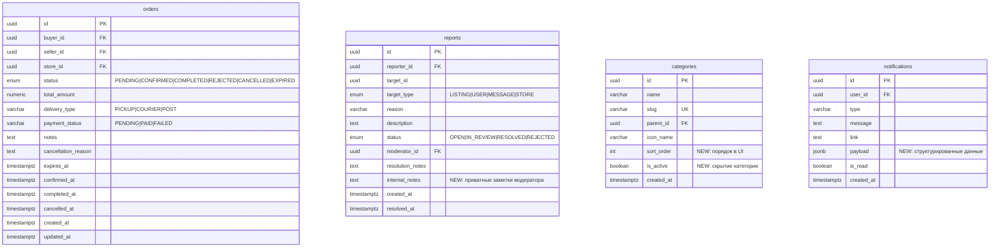

---

## 7. Сравнение моделей данных

| Таблица | Изменение | Тип | Обратная совместимость |
|---------|-----------|-----|----------------------|
| `orders` | Добавить `cancellation_reason TEXT` | ADD COLUMN | ✅ Совместимо |
| `orders` | Добавить `delivery_type VARCHAR` DEFAULT 'PICKUP' | ADD COLUMN | ✅ Совместимо |
| `orders` | Добавить `payment_status VARCHAR` DEFAULT 'PENDING' | ADD COLUMN | ✅ Совместимо |
| `orders` | Добавить `notes TEXT` | ADD COLUMN | ✅ Совместимо |
| `reports` | Добавить `internal_notes TEXT` | ADD COLUMN | ✅ Совместимо |
| `categories` | Добавить `sort_order INT DEFAULT 0` | ADD COLUMN | ✅ Совместимо |
| `categories` | Добавить `is_active BOOL DEFAULT true` | ADD COLUMN | ✅ Совместимо |
| `notifications` | Добавить `payload JSONB DEFAULT '{}'` | ADD COLUMN | ✅ Совместимо |
| `products` | Устаревшая таблица, но используется в `listings.product_id` | НЕ УДАЛЯТЬ | ⚠️ Нужен аудит |
| `listings` | Добавить `views_count INT DEFAULT 0` | ADD COLUMN | ✅ Совместимо |
| `stores` | Добавить `followers_count INT DEFAULT 0` | ADD COLUMN | ✅ Совместимо (денормализация) |

### Таблица `products` — статус

**Факт:** Таблица `products` создана в начальной миграции. В `listings` есть FK `product_id`. В коде (`publishListing`) поле `product_id` **не передаётся** — значение будет NULL. Таблица фактически **не используется**, но с ней существует FK. Рекомендация: не удалять сейчас, провести аудит данных в production.

---

## 8. Схема административной панели

### 8.1 Информационная архитектура (целевая)

```
/admin
├── /admin (Dashboard)
│   ├── Пользователи: total, новые за 7 дней, заблокированные
│   ├── Объявления: total, ACTIVE, BLOCKED
│   ├── Заказы: total, PENDING, COMPLETED сегодня
│   ├── Магазины: total, PENDING (ждут верификации)
│   ├── Жалобы: OPEN + IN_REVIEW
│   └── B2B заявки: PENDING
├── /admin/users (список + поиск по имени/email)
│   └── /admin/users/[id] (детальная: профиль, объявления, жалобы, журнал)  ← ОТСУТСТВУЕТ
├── /admin/listings (список + фильтр статус/категория)
│   └── /admin/listings/[id] (просмотр карточки, модерация)  ← ОТСУТСТВУЕТ
├── /admin/reports (список + фильтр статус)
├── /admin/stores (список + статусы + approve/suspend)
│   └── /admin/stores/[id]  ← ОТСУТСТВУЕТ
├── /admin/orders (список + фильтр)
│   └── /admin/orders/[id]  ← ОТСУТСТВУЕТ
├── /admin/audit-logs (журнал)
├── /admin/requests (B2B заявки)
│   └── /admin/requests/[id] + approve/reject  ← ОТСУТСТВУЕТ
├── /admin/account-deletions (запросы на удаление)
└── /admin/categories  ← ПОЛНОСТЬЮ ОТСУТСТВУЕТ
```

### 8.2 Dashboard — источники данных

| Метрика | SQL источник | Индекс | Обновление |
|---------|-------------|--------|-----------|
| Всего пользователей | `COUNT(*) FROM profiles` | — | Per request |
| Новые за 7 дней | `COUNT(*) FROM profiles WHERE created_at > now()-7d` | `profiles(created_at)` | Per request |
| Заблокированные | `COUNT(*) FROM profiles WHERE is_banned=true` | Partial index рекомендуется | Per request |
| ACTIVE объявления | `COUNT(*) FROM listings WHERE status='ACTIVE'` | `idx_listings_status` | Per request |
| BLOCKED объявления | `COUNT(*) FROM listings WHERE status='BLOCKED'` | `idx_listings_status` | Per request |
| Магазины PENDING | `COUNT(*) FROM stores WHERE status='PENDING'` | Нет индекса на status | Per request |
| Заказы PENDING | `COUNT(*) FROM orders WHERE status='PENDING'` | `idx_orders_status` | Per request |
| Жалобы OPEN | `COUNT(*) FROM reports WHERE status='OPEN'` | Нет индекса на status | Per request |
| B2B заявки PENDING | `COUNT(*) FROM b2b_applications WHERE status='PENDING'` | Нет индекса на status | Per request |

> **Рекомендации:** добавить индексы на `stores(status)`, `reports(status)`, `b2b_applications(status)`.

### 8.3 Разрешённые переходы статуса объявления

```
ACTIVE → DEACTIVATED (admin: скрыть)
ACTIVE → BLOCKED (admin: заблокировать)
DEACTIVATED → ACTIVE (admin: восстановить)
BLOCKED → ACTIVE (только SUPER_ADMIN)
```

Реализовано: через `admin_moderate_listing` RPC с проверкой роли.

---

## 9. Матрица ролей и разрешений

> Подтверждено по `src/lib/rbac.ts` и миграциям.

| Ресурс / Действие | USER | SUPPORT | MODERATOR | ADMIN | SUPER_ADMIN |
|---|:---:|:---:|:---:|:---:|:---:|
| Профили (просмотр) | ✅ own | ✅ all | ✅ all | ✅ all | ✅ all |
| Профили (редактирование) | ✅ own | ❌ | ❌ | ✅ all | ✅ all |
| Блокировка пользователя | ❌ | ❌ | ❌ | ✅ | ✅ |
| Смена роли | ❌ | ❌ | ❌ | ❌ | ✅ |
| Объявления (просмотр) | ✅ active+own | ✅ all | ✅ all | ✅ all | ✅ all |
| Объявления (создание) | ✅ | ❌ | ❌ | ❌ | ❌ |
| Объявления (модерация) | ❌ | ❌ | ✅ | ✅ | ✅ |
| Жалобы (создание) | ✅ | ❌ | ❌ | ❌ | ❌ |
| Жалобы (просмотр) | ✅ own | ✅ all | ✅ all | ✅ all | ✅ all |
| Жалобы (решение) | ❌ | ❌ | ✅ | ✅ | ✅ |
| Магазины (просмотр) | ✅ public | ✅ all | ✅ all | ✅ all | ✅ all |
| Магазины (модерация) | ❌ | ❌ | ✅ | ✅ | ✅ |
| Заказы (просмотр) | ✅ own | ✅ all | ❌ | ✅ all | ✅ all |
| Журнал аудита | ❌ | ❌ | ❌ | ✅ | ✅ |
| Управление ролями | ❌ | ❌ | ❌ | ❌ | ✅ |

**Серверная проверка (подтверждено):** все admin-действия проходят через `verifyAdminAccess(permission)` + `hasPermission()`. RPC на уровне БД дополнительно проверяют роль актора из `profiles.role`.

---

## 10. Диаграммы ключевых бизнес-процессов

### 10.1 Жизненный цикл объявления

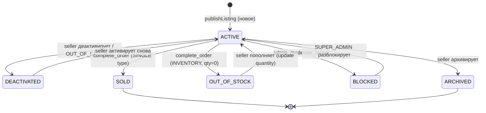

### 10.2 Жизненный цикл заказа

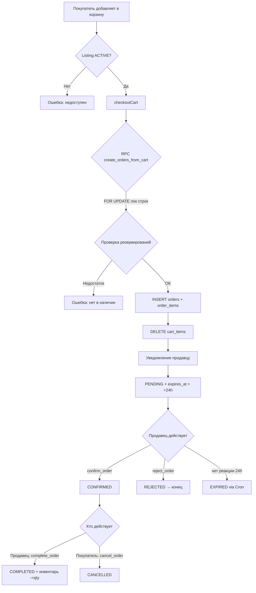

### 10.3 Жизненный цикл жалобы

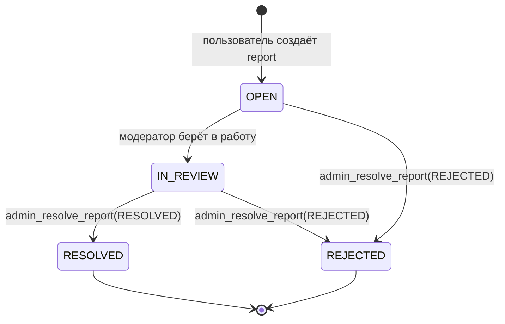

### 10.4 Жизненный цикл пользователя

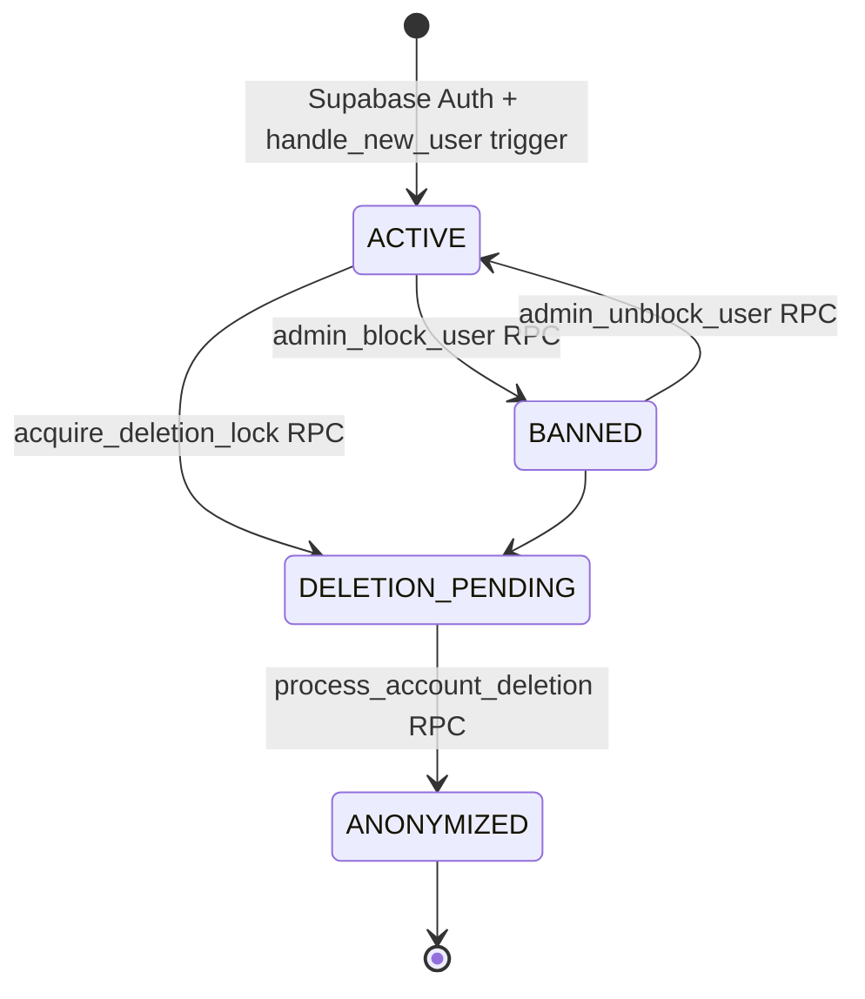

### 10.5 Жизненный цикл магазина

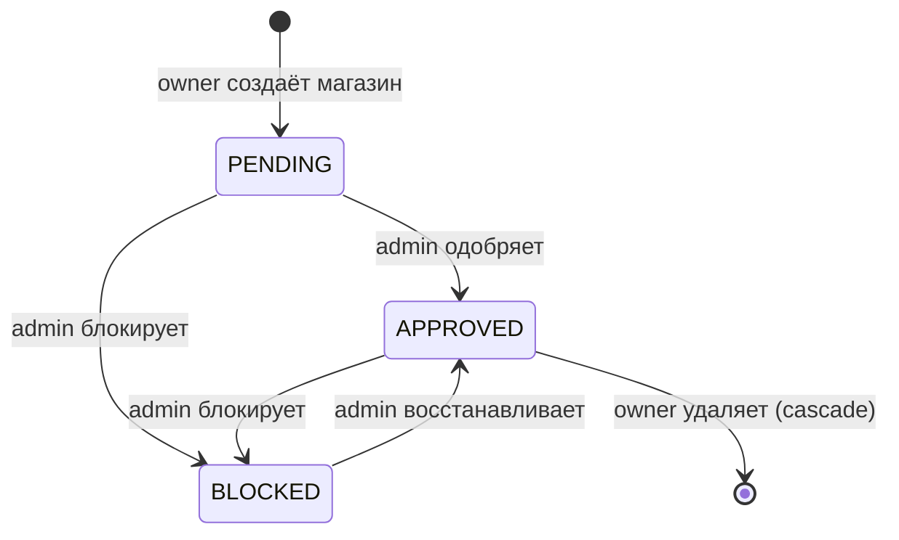

### 10.6 Жизненный цикл запроса и предложения

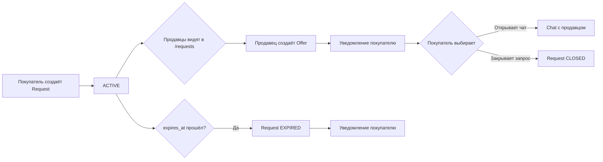

---

## 11. Схема событий и уведомлений

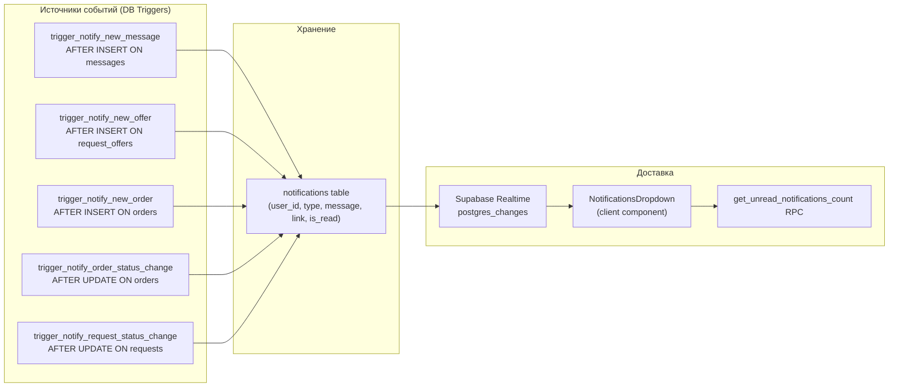

**Типы уведомлений (подтверждены):**
- `NEW_MESSAGE` — новое сообщение в чате
- `NEW_OFFER` — новое предложение на запрос покупателя
- `NEW_ORDER` — продавец получил новый заказ
- `ORDER_STATUS` — изменение статуса заказа (CONFIRMED, REJECTED, CANCELLED, COMPLETED)
- `REQUEST_EXPIRED` — запрос покупателя истёк

**Известные ограничения:**
1. Уведомления при отмене заказа (`CANCELLED`) всегда идут продавцу — покупатель не получает уведомление при отмене продавцом.
2. Сообщения уведомлений на русском языке — нет i18n для push-текстов.
3. Нет дедупликации — при частых событиях могут дублироваться уведомления.
4. Нет TTL для прочитанных уведомлений — таблица растёт неограниченно.

---

## 12. Комплексный реестр проблем

### P0 — Критические (блокируют пользователя)

| # | Проблема | Файл/Таблица | Доказательство | Приоритет |
|---|---------|-------------|---------------|---------|
| P0-1 | `create_orders_from_cart` в `stage9_1_hardening.sql` не передаёт `payment_status`/`delivery_type` в INSERT. Если эти поля есть в схеме как NOT NULL без DEFAULT — checkout упадёт | `20260919180000_stage9_1_hardening.sql` + `20260924200001_p1_checkout_return.sql` | Нужна проверка в production: вызов checkout → ошибка БД | КРИТИЧЕСКИЙ |
| P0-2 | Уведомление CANCELLED направляется продавцу независимо от инициатора. Если покупатель отменяет заказ, продавец уведомлён, но покупатель — нет. | `20260924200000_p1_notifications_trigger.sql` | Код: `ELSIF NEW.status = 'CANCELLED' THEN v_recipient_id := NEW.seller_id` | ВЫСОКИЙ |

### P1 — Серьёзные (ухудшают UX или безопасность)

| # | Проблема | Файл | Статус | Приоритет |
|---|---------|------|--------|---------|
| P1-1 | Нет пагинации в `/admin/users/page.tsx`. Запрос `LIMIT 50` — но без OFFSET/страниц. При росте > 50 пользователей старые не видны | `admin/users/page.tsx` | ⚠️ Подтверждено | ВЫСОКИЙ |
| P1-2 | Нет страницы детали пользователя `/admin/users/[id]`. Нет просмотра истории объявлений, жалоб, заказов конкретного пользователя | — | ❌ Отсутствует | ВЫСОКИЙ |
| P1-3 | Нет UI для управления ролями (назначение MODERATOR, SUPPORT). Сейчас только через DB напрямую | — | ❌ Отсутствует | ВЫСОКИЙ |
| P1-4 | Уведомления на русском языке в триггерах. Пользователи с KY локалью получают RU уведомления | `p1_notifications_trigger.sql` | ⚠️ Подтверждено | СРЕДНИЙ |
| P1-5 | Нет ресайза изображений. Загружаются полноразмерные файлы. На мобильных устройствах → медленная загрузка | `sell.ts` → Supabase Storage upload | ⚠️ Подтверждено | СРЕДНИЙ |
| P1-6 | Нет `LIKED`/`unread badge` на иконке сообщений в хедере (есть только в notifications) | `header.tsx`, `chat-list.tsx` | ⚠️ Подтверждено | СРЕДНИЙ |
| P1-7 | `notifications` таблица без TTL — растёт неограниченно. При ~100 событий/день × 365 дней = 36 500 строк на пользователя | `notifications` table | ⚠️ Архитектурная | СРЕДНИЙ |
| P1-8 | Admin dashboard: счётчик `reports` фильтрует по `status='PENDING'`, но такого статуса нет — есть `OPEN`. Счётчик всегда покажет 0 | `admin/page.tsx`: `.eq('status', 'PENDING')` | ✅ Подтверждено | ВЫСОКИЙ |
| P1-9 | Нет индекса на `stores(status)`, `reports(status)`, `b2b_applications(status)` — медленные фильтрации в админке | Миграции | ⚠️ Подтверждено | СРЕДНИЙ |

### P2 — Умеренные (технический долг)

| # | Проблема | Файл | Статус |
|---|---------|------|--------|
| P2-1 | Таблица `products` не используется реально (поле `product_id` в listings всегда NULL в коде). Существует как мёртвый вес | `initial_schema.sql` | ⚠️ Аудит |
| P2-2 | 356 ESLint ошибок (`@typescript-eslint/no-explicit-any`). Не блокируют, но усложняют поддержку | Весь код | Исторический долг |
| P2-3 | `complete_order` RPC принимает `executing_user UUID` как параметр, но новая версия в hardening использует `auth.uid()`. Могут сосуществовать два определения | `stage9_orders_search.sql` + `stage9_1_hardening.sql` | ⚠️ Проверить |
| P2-4 | Нет пагинации в `/admin/stores`, `/admin/orders` — только первые N записей | `admin/*.page.tsx` | ⚠️ Подтверждено |
| P2-5 | `popular-products.tsx` использует `.eq("region", activeRegion)` — но поле называется `region` только после миграции `stage8_regions`. Если cookie `bazargo_region` содержит значение до применения миграции — ошибка | `popular-products.tsx` | ⚠️ Потенциальная |
| P2-6 | Нет очереди удаления старых уведомлений (старше 90 дней) | — | Отсутствует |
| P2-7 | Отсутствует e2e тест для полного пути покупки | `tests/e2e/` | Отсутствует |

### ✅ Ранее поднятые проблемы — ИСПРАВЛЕНО

| # | Проблема | Статус |
|---|---------|--------|
| ✅ | Mock-данные на главной — `popular-products.tsx` теперь запрашивает реальные данные из БД | Исправлено |
| ✅ | `trending-stores.tsx` теперь запрашивает реальные магазины | Исправлено |
| ✅ | Пагинация каталога — реализована (20/стр, `CatalogLoadMore`) | Исправлено |
| ✅ | Пагинация чатов — RPC `get_chats_with_unread(limit, offset)` | Исправлено |
| ✅ | Корзина и оформление заказа — атомарное RPC, возвращает ID | Исправлено |
| ✅ | Очистка изображений при редактировании — реализовано в `sell.ts` | Исправлено |
| ✅ | Уведомления — реализованы через триггеры | Исправлено |
| ✅ | globals.css и ThemeProvider — исправлено | Исправлено |
| ✅ | Локализация ru/ky — завершена | Исправлено |

---

## 13. Анализ безопасности

### ✅ Реализовано и подтверждено

| Механизм | Доказательство | Уровень риска |
|---------|---------------|--------------|
| RLS на всех ключевых таблицах | Все миграции | Низкий |
| Защита от самоповышения роли | Trigger `prevent_privilege_escalation` | Низкий |
| Admin RPC callable только service_role | `REVOKE/GRANT` в миграциях | Низкий |
| Storage path ownership (`userId/...`) | `p0_security_audit.sql` | Низкий |
| Блокировка чатов при взаимном блоке | RLS policy на `messages`, `chats` | Низкий |
| Rate limit на сообщения (60/5мин) | `send_message_transaction` | Низкий |
| Rate limit на объявления (10/час) | `check_rate_limit` RPC в `sell.ts` | Низкий |
| Конкурентная блокировка checkout (`FOR UPDATE`) | `create_orders_from_cart` | Низкий |
| Expiration токенов (fencing token) для удаления аккаунта | `deletion_fencing_token.sql` | Низкий |
| Запрет выполнения RPCs анонимами | `REVOKE` в hardening | Низкий |
| Protect order integrity trigger | `protect_order_integrity` | Низкий |
| Protect listing integrity trigger | `protect_listing_integrity` | Низкий |
| Cron endpoint защищён CRON_SECRET | `expire-orders/route.ts` | Низкий |

### ⚠️ Подтверждённые проблемы безопасности

| # | Проблема | Уровень риска | Рекомендация |
|---|---------|--------------|-------------|
| S1 | `old audit_logs` таблица создана дважды (в `p0_security_audit.sql` и `compliance_admin_rbac.sql`) с разными схемами (разные поля). Итоговая схема — та, что применилась последней. Риск: один из кодовых путей пишет в неверные поля | СРЕДНИЙ | Проверить в production, привести к единой схеме в миграции |
| S2 | `protect_profile_escalation` trigger проверяет только `role='ADMIN'`, тогда как RBAC код проверяет `role IN ('ADMIN', 'SUPER_ADMIN')`. Несогласованность — SUPER_ADMIN на уровне триггера может не пройти проверку | СРЕДНИЙ | Обновить trigger: `role IN ('ADMIN', 'SUPER_ADMIN')` |
| S3 | Нет rate limit на создание жалоб. Пользователь может заспамить отчёты | НИЗКИЙ | Добавить `check_rate_limit('create_report', 10, 60)` |
| S4 | `reports.reporter_id` ссылается на `auth.users`, а не `profiles`. Неконсистентно с остальными FK. При удалении пользователя через `process_account_deletion` запись остаётся с `reporter_id = id` удалённого пользователя | НИЗКИЙ | Принять как допустимое (ON DELETE SET NULL) |
| S5 | Нет защиты от перебора ID в admin-маршрутах. Любой ADMIN может обратиться к `/admin/users?q=` и перебрать пользователей | ИНФОРМАЦИОННЫЙ | Нормально для admin-панели |

### ❓ Невозможно проверить без доступа к окружению

- Реальное применение миграций в production (порядок и результат)
- Суперпользователь Supabase — ограничения
- Настройки GoTrue (session TTL, refresh intervals)

---

## 14. Анализ производительности

### Необходимо сейчас

| Проблема | Рекомендация | Срочность |
|---------|-------------|---------|
| Нет индекса на `stores(status)`, `reports(status)`, `b2b_applications(status)` | Добавить в следующей миграции | 🔴 Высокая |
| `admin/page.tsx` — 5 COUNT запросов параллельно без индексов | После добавления индексов — приемлемо | 🟡 Средняя |
| Нет ресайза изображений — загружаются оригиналы | Использовать Supabase Image Transformation API (встроен, не требует инфраструктуры) | 🟡 Средняя |
| Уведомления без TTL | Добавить удаление старых (>90 дней) через cron или pg_cron | 🟡 Средняя |

### Необходимо при росте нагрузки (>10K активных пользователей)

| Рекомендация | Когда |
|------------|------|
| Partial indexes для горячих запросов (`listings WHERE status='ACTIVE'`) | >100K объявлений |
| Materialized views для dashboard analytics | >1M строк в ключевых таблицах |
| Кэширование на уровне Next.js (`unstable_cache`, ISR) для публичных страниц каталога | >10K RPS |
| pg_cron вместо Vercel Cron для надёжности | Production критично |
| Cursor-based pagination вместо OFFSET для глубоких страниц | >50 страниц |
| Realtime channel pooling (одна подписка на все события vs. несколько) | >1K concurrent users |

### Потенциально преждевременные

- Redis для сессий (Supabase справляется)
- Elasticsearch вместо pg_trgm (только при >1M объявлений)
- Микросервисная архитектура (текущий монолит легко масштабируется горизонтально)

---

## 15. Стратегия тестирования

### Матрица покрытия

| Функция | Unit | Схема (Zod) | Интеграция (SA) | RLS | RPC | E2E | Статус |
|---------|:----:|:-----------:|:---------------:|:---:|:---:|:---:|--------|
| Auth / Login | ❌ | ❌ | ❌ | ❌ | ❌ | ✅ | Частично |
| Catalog + поиск | ❌ | ❌ | ❌ | ❌ | ❌ | ✅ | Частично |
| Cart | ❌ | ❌ | ❌ | ❌ | ❌ | ✅ (redirect) | Минимально |
| Язык (i18n) | ❌ | ❌ | ❌ | ❌ | ❌ | ✅ | Покрыто |
| Создание объявления | ❌ | ✅ (Zod) | ❌ | ❌ | ❌ | ❌ | Критически пусто |
| Checkout (atomicity) | ❌ | ❌ | ❌ | ❌ | ❌ | ❌ | Критически пусто |
| Заказы (state machine) | ❌ | ❌ | ❌ | ❌ | ❌ | ❌ | Критически пусто |
| Admin (блокировка) | ❌ | ❌ | ❌ | ❌ | ❌ | ❌ | Критически пусто |
| Жалобы | ❌ | ❌ | ❌ | ❌ | ❌ | ❌ | Критически пусто |
| Уведомления | ❌ | ❌ | ❌ | ❌ | ❌ | ❌ | Критически пусто |
| RLS (ownership) | ❌ | ❌ | ❌ | ❌ | ❌ | ❌ | Критически пусто |

### Критические E2E сценарии (приоритизированные)

1. **Покупатель → заказ:** регистрация → поиск → добавление в корзину → оформление → проверка создания заказа
2. **Продавец → объявление:** вход → создание объявления с фото → проверка в каталоге
3. **Продавец → обработка заказа:** вход → просмотр нового заказа → подтверждение → завершение
4. **Чат:** покупатель открывает чат с продавца → отправляет сообщение → продавец видит
5. **Жалоба + модерация:** пользователь подаёт жалобу → модератор входит в `/admin/reports` → разрешает
6. **Admin: блокировка нарушителя:** вход как ADMIN → блокировка пользователя → проверка, что заблокированный не может войти
7. **Privilege escalation protection:** неадмин пытается вызвать `/admin/users` → редирект/отказ

---

## 16. Масштабный план разработки

### Рекомендуемый порядок

```
A → B (параллельно с C и F) → C → D → E → F (параллельно с E)
```

---

### Пакет A — Архитектура и база данных

**Текущая готовность:** 85%
**Конечный результат:** все схемы согласованы, критические дефекты устранены

| # | Задача | Риск | Миграция |
|---|-------|------|---------|
| A1 | Исправить дефект P0-1: проверить `payment_status`/`delivery_type` в orders, добавить DEFAULT или убрать NOT NULL | КРИТИЧЕСКИЙ | Нужна миграция |
| A2 | Исправить P1-8: admin dashboard `reports` фильтр → `OPEN` вместо `PENDING` | ВЫСОКИЙ | Только код |
| A3 | Добавить индексы на `stores(status)`, `reports(status)`, `b2b_applications(status)` | СРЕДНИЙ | Нужна миграция |
| A4 | Унифицировать `audit_logs` схему (двойное создание) | СРЕДНИЙ | Нужна миграция |
| A5 | Исправить `protect_profile_escalation` trigger: `role IN ('ADMIN', 'SUPER_ADMIN')` | СРЕДНИЙ | Нужна миграция |
| A6 | Добавить `orders.cancellation_reason`, `delivery_type DEFAULT 'PICKUP'`, `payment_status DEFAULT 'PENDING'` | НИЗКИЙ | Нужна миграция |
| A7 | Добавить `notifications.payload JSONB DEFAULT '{}'` | НИЗКИЙ | Нужна миграция |
| A8 | Добавить rate limit на создание жалоб | НИЗКИЙ | Нужна миграция |

**Критерии приёмки:** build успешен, все тесты проходят, critical bugs устранены

---

### Пакет B — Административная система

**Текущая готовность:** 50%
**Конечный результат:** полноценная admin-панель с CRUD, деталями, аудитом

| # | Задача |
|---|-------|
| B1 | `/admin/users/[id]` — детальная страница пользователя (объявления, заказы, жалобы, журнал) |
| B2 | `/admin/listings/[id]` — просмотр карточки, полная история модерации |
| B3 | `/admin/stores/[id]` — детали магазина, объявления, жалобы |
| B4 | `/admin/orders/[id]` — детали заказа |
| B5 | `/admin/requests/[id]` — детали B2B заявки + approve/reject |
| B6 | `/admin/categories` — CRUD категорий |
| B7 | `/admin/users` — пагинация, фильтр по роли/статусу |
| B8 | Dashboard: исправить счётчики (A2 + новые метрики: новые за 7д, сегодня завершённые) |
| B9 | Управление ролями через UI (только SUPER_ADMIN) |
| B10 | Управление search_synonyms через UI |

**Зависимости:** A1, A2, A3 должны быть завершены  
**Риск:** доступ к admin client с service_role key — не раскрывать в клиентском коде

---

### Пакет C — Основные пользовательские процессы

**Текущая готовность:** 75%

| # | Задача |
|---|-------|
| C1 | Unread badge на иконке Messages в хедере (real-time через Realtime подписку) |
| C2 | Исправить уведомление при CANCELLED заказа — notifiy both parties |
| C3 | Страница редактирования объявления `/sell?edit=[id]` — проверить UX |
| C4 | Загрузка аватара пользователя через UI |
| C5 | Кнопка "Выбрать предложение" в запросах — если нет, добавить статус ACCEPTED у offer |
| C6 | Страница `/store/[slug]` — вкладки: объявления, о магазине, подписчики |
| C7 | Пагинация в `/my-listings`, `/favorites`, `/orders`, `/requests` |

**Зависимости:** A6 (cancellation_reason для C2)

---

### Пакет D — Надёжность и безопасность

**Текущая готовность:** 80%

| # | Задача |
|---|-------|
| D1 | Rate limit на создание жалоб (A8) |
| D2 | Тест безопасности: user без роли ADMIN пытается вызвать admin action → должен получить ошибку |
| D3 | Добавить `CRON_SECRET` в Vercel env (если отсутствует) |
| D4 | Унификация `audit_logs` схемы (A4) |
| D5 | Исправить `protect_profile_escalation` (A5) |
| D6 | Добавить TTL для rate_limits (удалять записи старше 1 часа через cron) |

---

### Пакет E — Производительность и UX

**Текущая готовность:** 65%

| # | Задача |
|---|-------|
| E1 | Image optimization: использовать Supabase Transform API для ресайза при отдаче |
| E2 | TTL для уведомлений: удалять прочитанные старше 90 дней |
| E3 | Пагинация в admin pages (stores, orders) |
| E4 | Кэширование dashboard stats (30 сек `unstable_cache`) |
| E5 | Mobile: проверить overflow, кнопки в карточках на малых экранах |
| E6 | Skeleton loader на всех async компонентах |
| E7 | Error boundaries для chat-room, notifications |

---

### Пакет F — Качество и эксплуатация

**Текущая готовность:** 20%

| # | Задача |
|---|-------|
| F1 | E2E: полный путь покупки (buyer → order created) |
| F2 | E2E: продавец публикует объявление |
| F3 | E2E: продавец обрабатывает заказ |
| F4 | E2E: admin блокирует пользователя → проверка |
| F5 | E2E: privilege escalation protection |
| F6 | Unit тесты: `sell/schema.ts`, `requests/schema.ts` Zod schemas |
| F7 | Unit тесты: `hasPermission()` в rbac.ts |
| F8 | Интеграционные тесты: `checkoutCart` server action |
| F9 | Добавить Sentry или аналог для server-side error tracking |
| F10 | Документация API actions (JSDoc) |
| F11 | Исправить ESLint `any` типы в критических местах (sell.ts, cart.ts) |

---

## 17. Реестр архитектурных решений для согласования

| # | Решение | Варианты | Рекомендация | Требует согласования |
|---|---------|---------|-------------|---------------------|
| ADR-1 | Модерация объявлений — ввести статус PENDING (новые объявления на проверку) или оставить автопубликацию | A: автопубликация (сейчас) / B: PENDING для новых | Для MVP — автопубликация. После роста — модерация | ✅ ДА |
| ADR-2 | Notifications i18n — хранить тип + payload в БД и переводить на клиенте vs. хранить готовый текст | A: type+payload (масштабируемо) / B: текст в БД (проще) | A: тип+payload, перевод на клиенте | ✅ ДА |
| ADR-3 | `products` таблица — оставить, использовать, или помечить устаревшей | A: оставить (сейчас) / B: начать использовать / C: планировать удаление | Аудит в production → решение | ✅ ДА |
| ADR-4 | Доставка (delivery_type) — только PICKUP сейчас. Когда добавлять COURIER/POST? | A: следующий пакет / B: MVP релиз без | Зависит от бизнес-приоритетов | ✅ ДА |
| ADR-5 | Оплата (payment_status) — есть поле в схеме, нет реальной интеграции. Оставить или убрать поле? | A: оставить задел / B: убрать до интеграции | Оставить с DEFAULT 'PENDING' | ✅ ДА |
| ADR-6 | B2B заявки — одобрение через admin/requests/[id]. Что происходит после APPROVED? Пользователь получает роль? | Не определено | Требует бизнес-решения | ✅ ДА |
| ADR-7 | Рейтинги магазинов и продавцов — поле `rating` в StoreCard уже есть (=0). Ввести систему отзывов? | A: да / B: нет | Отложить после релиза | ✅ ДА |

---

## 18. Открытые вопросы

1. **P0-1 (критический):** Применена ли миграция `p1_checkout_return.sql` в production? Есть ли `payment_status`/`delivery_type` как NOT NULL в схеме production-базы? Это определяет приоритет A1.

2. **Дублирование RPC `complete_order`:** Две версии — со `executing_user UUID` (stage9_orders) и без (stage9_1_hardening). Какая актуальна в production?

3. **B2B процесс:** Что происходит при APPROVED B2B заявке? Меняется ли роль пользователя? Создаётся ли магазин автоматически?

4. **`products` таблица в production:** Есть ли в ней реальные данные? Используется ли поле `product_id` в listings?

5. **pg_cron:** Установлен ли `pg_cron` в production Supabase? Или экспирация заказов происходит только через Vercel Cron (что менее надёжно)?

6. **CRON_SECRET:** Настроен ли он в production environment?

7. **Supabase plan:** Какой тарифный план? Это влияет на доступность pg_cron, image transforms, realtime limits.

8. **Ожидаемая нагрузка:** Какое количество пользователей и объявлений планируется в первые 6 месяцев? Это определяет приоритет задач E.

---

*Документ подготовлен в режиме read-only анализа. Никакие изменения в код, миграции или данные не вносились.*
